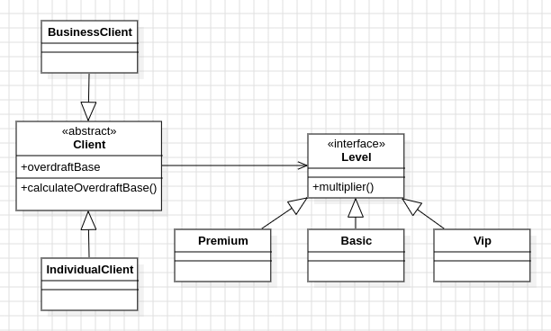

<h1>
    
    DESIGN PATTERN: BRIDGE
</h1>
The Bridge design pattern is employed in this project to separate the abstraction (client) from its implementation (level of service). This separation allows the abstraction and implementation to vary independently, enabling flexibility and easier maintenance of the codebase. By encapsulating the implementation details in separate classes (e.g., Basic, Premium, Vip), the Bridge pattern promotes loose coupling and enhances extensibility, as new levels of service can be added without modifying the client classes.

<h2>
    
    About project
</h2>

<p>
This project is a banking system that manages different types of clients, such as individual and business clients, each with varying levels of service. It employs the Bridge design pattern to decouple the abstraction of clients from their implementation of service levels. The Client abstract class defines common attributes and methods shared by all client types, while concrete client classes extend it to provide specific implementations. The ILevel interface represents different levels of service, with concrete implementations determining the multiplier for calculating overdraft bases. This approach enhances flexibility and maintainability by allowing the abstraction and implementation to vary independently, facilitating future expansions and modifications to the system.
</p>

<h2>
    
    Class diagram
</h2>

<p align="center">
 
</p>

# Project structure

```
- 📁 src
  - 📁 main
    - 📁 java
      - 📁 com
        - 📁 example
          - 📁 clients
            - 📄 BusinessClient.java
            - 📄 Client.java
            - 📄 IndividualClient.java
          - 📁 levels
            - 📄 Basic.java
            - 📄 ILevel.java
            - 📄 Premium.java
            - 📄 Vip.java
        - 📁 resources
  - 📁 test
    - 📁 java
      - 📁 com/example/models
          - 📄 BusinessClientTest.java
          - 📄 IndividualClientTest.java

```
